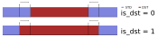
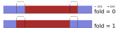

Migration Guide
===============

This guide explains how to migrate from using ``pytz`` to a
:pep:`495`-compatible library, either the standard library module
:mod:`zoneinfo` (or its backport, :pypi:`backports.zoneinfo`), or
:pypi:`python-dateutil`.

Which replacement to choose?
----------------------------

If you only need to support Python 3, you should use :mod:`zoneinfo`. If you
need to support Python 2 and Python 3, you should either use
:mod:`dateutil.tz` or a combination of ``zoneinfo`` and ``dateutil``. The
shim classes use ``dateutil`` in Python 2 and ``zoneinfo`` in Python 3.

You can also directly use the shim classes if desired; the shim classes are,
themselves, :pep:`495`-compatible time zone implementations. As long as you do
not use any part of the ``pytz``-specific interface, they will not raise any
warnings. There is, however, some performance overhead associated with this as
compared to using the underlying libraries directly.

If your time zones are coming from a source that returns
``pytz_deprecation_shim`` shim time zones, you can upgrade them to the PEP
495-compatible zone that they are a wrapper around using
:func:`pytz_deprecation_shim.helpers.upgrade_tzinfo`.

For more information about how to get time zones from the replacement you've
chosen, see the section on :ref:`acquiring a tzinfo object <acquiring-tzinfo>`.

Creating an aware datetime ("localizing" datetimes)
---------------------------------------------------

With :pep:`495`-compatible zones, there is no longer any need to use
``localize``, you can directly attach a time zone to your ``datetime``:

.. code-block:: python

    import zoneinfo
    from datetime import datetime

    NYC = zoneinfo.ZoneInfo("America/New_York")
    datetime(2020, 1, 1, tzinfo=NYC)

If you have a naïve ``datetime`` (or one you'd like to "reinterpret" an aware
``datetime`` as being in another zone), use :meth:`~datetime.datetime.replace`:

.. code-block:: python

    datetime(2020, 1, 1).replace(tzinfo=NYC)

Ambiguous and imaginary times
#############################

Whenever a time zone's UTC offset changes (such as during a Daylight Saving
Time / Summer Time transition), this creates either a gap ("imaginary" times)
of times that have been skipped over in local time or a fold (ambiguous times),
where there are two possible local times with the same "wall time". This is the
problem that :pep:`495` was created to address.

When using a PEP 495-compatible time zone, use the ``fold`` attribute to select
the behavior you expect during these times. ``fold=0`` (the default)
corresponds to the offset that applied *before* the transition, while
``fold=1`` corresponds to the offset that applies *after* the transition:

.. code-block:: pycon

    >>> dt = datetime(2020, 11, 1, 1, tzinfo=ZoneInfo("America/Los_Angeles"))
    >>> print(dt)
    2020-11-01 01:00:00-07:00
    >>> dt.tzname()
    'PDT'

    >>> dt_enfolded = dt.replace(fold=1)
    >>> print(dt_enfolded)
    2020-11-01 01:00:00-08:00
    >>> dt_enfolded.tzname()
    'PST'

Since PEP 495 was introduced in Python 3.6, the ``fold`` attribute is not
available in earlier versions of Python. However, ``dateutil`` provides a
backport for this feature via :func:`dateutil.tz.enfold`. If you are still
supporting Python 2, you can use ``tz.enfold``:

.. code-block:: pycon

    >>> dt = datetime(2020, 11, 1, 1, tzinfo=ZoneInfo("America/Los_Angeles"))
    >>> print(dt)
    2020-11-01 01:00:00-07:00
    >>> dt.tzname()
    'PDT'

    >>> from dateutil import tz
    >>> dt = datetime(2020, 11, 1, 1, tzinfo=tz.gettz("America/Los_Angeles"))
    >>> dt.tzname()
    'PDT'

    >>> dt_enfolded = tz.enfold(dt)
    >>> dt_enfolded.tzname()
    'PST'

The ``tz.enfold`` function is also compatible with the ``zoneinfo`` module, and
can be used unconditionally in 2/3 compatible code that uses different time
zone providers in Python 2 and 3.

Semantic differences between ``is_dst`` and ``fold``
^^^^^^^^^^^^^^^^^^^^^^^^^^^^^^^^^^^^^^^^^^^^^^^^^^^^

As mentioned in the previous section, during a fold or a gap, the offset
information that applies is ill-defined. With ``pytz`` you disambiguate between
these choices by using ``is_dst`` to select which side of the transition you
want to interpret your naïve datetime as.  With :pep:`495`, you choose that by
setting the ``fold`` attribute of the ``datetime``. Unfortunately, ``is_dst``
and ``fold`` do not cleanly map onto one another, because ``is_dst`` intends to
choose whether to interpret the time as "daylight saving time" vs "standard
time", whereas ``fold`` selects between "the first offset" and "the second
offset". PEP 495 made the choice to avoid any explicit reference to DST because
not all folds and gaps are created by DST-related transitions.

To demonstrate the difference, consider the timeline of a year with a standard
time (STD) → daylight saving time (DST) transition in spring and its inverse in
fall:

During a fold or a gap, ``.utcoffset()``, ``.dst()`` and ``tzname()`` for a
given datetime are ill-defined, and so a disambiguation method like ``is_dst``
or ``fold`` needs to be introduced. With ``pytz``'s ``is_dst``, the user is
selecting whether to choose the DST or the STD offset when more than one answer
is possible. The offsets that apply at each time during the year are
illustrated below, with "returns DST offsets" shown in red, and "returns STD
offsets" shown in blue:

With :pep:`495`'s ``fold``, however, the user selects between whether to apply
the offset from *before* the transition (``fold = 0``) or *after* the
transition (``fold = 1``), as illustrated below:

These two don't map onto one another perfectly. Most people likely care about
the behavior during folds rather than gaps, because each ambiguous time during
a fold represents a real time that occurred, whereas during gaps the primary
ambiguity is due to the fact that in a sense both offsets are equally wrong,
since no such time occurred. During the folds, the ``is_dst`` behavior can be
approximated by setting ``fold = not is_dst``, which will be valid except in in
cases of `negative daylight saving time (Winter time)
<https://en.wikipedia.org/wiki/Winter_time_(clock_lag)>`_, such as occurs in
``Europe/Dublin`` zone (the behavior of ``is_dst`` during offset shifts
unrelated to daylight saving time doesn't seem like it would be well-defined,
but a spot check of 1969-09-30T12 in the ``Pacific/Kwajalein`` zone indicates
that ``fold = not is_dst`` has the same behavior).

Detecting ambiguous and imaginary times
#######################################

``pytz`` provides the option to raise an exception if the user attempts to
localize a ``datetime`` that falls during a gap or a fold. Since ``zoneinfo``
and ``dateutil.tz`` don't have an explicit localization step, there is no
analogous option to throw an error, but it can be re-created using the
``dateutil`` functions :func:`dateutil.tz.datetime_ambiguous` and
:func:`dateutil.tz.datetime_exists`, which work independent of the time zone
provider in both Python 2 and 3.

So, if your ``pytz`` code looks like the following:

.. code-block:: python

    import pytz

    try:
        zone.localize(dt, is_dst=None)
    except pytz.NonExistentTimeError:
        handle_non_existent_time(dt)
    except pytz.AmbiguousTimeError:
        handle_ambiguous_time(dt)

You can replace it with the following:

.. code-block:: python

    from dateutil import tz

    dt = dt.replace(tzinfo=zone)  # Only needed if `dt` is naive

    if not tz.datetime_exists(dt):
        handle_non_existent_time(dt)
    elif tz.datetime_ambiguous(dt):
        handle_ambiguous_time(dt)

If you are using ``zoneinfo`` and do not want to take on a ``dateutil``
dependency for this purpose, these functions can be approximated easily enough:

.. code-block:: python

    from datetime import timezone
    def datetime_exists(dt):
        """Check if a datetime exists."""
        # There are no non-existent times in UTC, and comparisons between
        # aware time zones always compare absolute times; if a datetime is
        # not equal to the same datetime represented in UTC, it is imaginary.
        return dt.astimezone(timezone.utc) == dt

    def datetime_ambiguous(dt):
        """Check whether a datetime is ambiguous."""
        # If a datetime exists and its UTC offset changes in response to
        # changing `fold`, it is ambiguous in the zone specified.
        return datetime_exists(dt) and (
            dt.replace(fold=not dt.fold).utcoffset() != dt.utcoffset())

Handling datetime arithmetic ("normalizing" datetimes)
------------------------------------------------------

With ``pytz``, after any arithmetical operation on an aware ``datetime``, it
needs to be "normalized", in case the addition has resulted in a ``datetime``
with a different offset from the originally-localized datetime. This is not the case with :pep:`495`-compatible datetimes, and arithmetic that crosses a transition boundary will have the correct offset values. For example:

.. code-block:: pycon

    >>> from zoneinfo import ZoneInfo
    >>> from datetime import datetime

    >>> dt = datetime(1992, 3, 1, tzinfo=ZoneInfo("Europe/Minsk"))
    >>> print(dt)
    1992-03-01 00:00:00+02:00
    >>> print(dt.utcoffset())
    2:00:00
    >>> dt.tzname()
    'EET'

    >>> dt += timedelta(days=90)
    >>> print(dt)
    1992-05-30 00:00:00+03:00
    >>> print(dt.utcoffset())
    3:00:00
    >>> dt.tzname()
    'EEST'

However, because this is using standard ``datetime`` mechanisms, the semantics
are slightly different (see `Semantics of timezone-aware datetime arithmetic
<https://blog.ganssle.io/articles/2018/02/aware-datetime-arithmetic.html>`_ for
a more in-depth article on the subject). With a ``pytz`` "add-and-normalize"
workflow, all addition is "absolute time" arithmetic (i.e.  as if it were
performed in UTC), whereas standard ``datetime`` arithmetic is "wall time"
arithmetic.

So, an example of addition across a DST boundary using ``pytz``:

.. code-block:: pycon

    >>> NYC = pytz.timezone("America/New_York")
    >>> dt1 = NYC.localize(datetime(2018, 3, 10, 13))
    >>> print(dt1)
    2018-03-10 13:00:00-05:00

    >>> dt2 = dt1 + timedelta(days=1)
    >>> print(dt2)  # Note the offset has not changed!
    2018-03-11 13:00:00-05:00

    >>> print(NYC.normalize(dt2)) # Note the offset and time both change
    2018-03-11 14:00:00-04:00

With a :pep:`495` workflow, the default is to use "wall time" arithmetic, so
``timedelta(days=1)`` will produce the same time of day on the following day,
regardless of whether 24 hours will have elapsed in local time or not. So code
similar to the operation above instead gives you:

.. code-block:: pycon

    >>> NYC = ZoneInfo("America/New_York")
    >>> dt1 = datetime(2018, 3, 10, 13, tzinfo=NYC)
    >>> print(dt1)
    2018-03-10 13:00:00-05:00

    >>> dt2 = dt1 + timedelta(days=1)
    >>> print(dt2)
    2018-03-11 13:00:00-04:00

It is worth noting that this "wall time" arithmetic may produce an imaginary or
ambiguous time. To handle that situation, see `Detecting ambiguous and
imaginary times`_.

If you want "absolute time" rather than "wall time" arithmetic, the best option
is to perform the arithmetic in UTC. Here is a simple helper function for that
purpose (in Python 2 or 2/3 compatible code, replace ``datetime.timezone.utc``
with ``dateutil.tz.UTC``):

.. code-block:: python

    from datetime import timezone
    def absolute_add(dt, td):
        dt_utc = dt.astimezone(timezone.utc)
        return (dt_utc + td).astimezone(dt.tzinfo)

This will have the same semantics as "add and normalize" in ``pytz``, and
similarly guarantees that the result exists.

Getting a time zone's name
--------------------------

``pytz`` zones have a ``.zone`` attribute that exposes the key used to created
it from the IANA time zone database. The equivalent attribute on
``zoneinfo.ZoneInfo`` objects is :attr:`zoneinfo.ZoneInfo.key`. There is
currently no equivalent for this in ``dateutil`` zones.

You can also recover this information by calling ``str`` on a ``pytz`` zone, a
shim class zone (even in Python 2), or a ``zoneinfo.ZoneInfo`` zone, e.g.:

.. code-block:: pycon

    >>> LA = zoneinfo.ZoneInfo("America/Los_Angeles")
    >>> str(LA)
    'America/Los_Angeles'

.. _acquiring-tzinfo:

Acquiring a ``tzinfo`` object
-----------------------------

Most of this guide assumes that you already have a time zone object, because
it is aimed at people who were using ``pytz``-specific features of a time zone
returned by a library that is switching over to use a PEP 495-compatible time
zone provider. However, if you are *also* creating your own ``pytz`` objects,
or you want to switch to directly creating ``tzinfo`` objects yourself, this
section covers creating PEP 495-compatible ``tzinfo`` objects.

IANA zones
##########

With ``pytz``, one creates an IANA / Olson time zone object via the
``pytz.timezone`` function, like so:

.. code-block:: python

    import pytz
    LA = pytz.timezone("America/Los_Angeles")
    # <DstTzInfo 'America/Los_Angeles' LMT-1 day, 16:07:00 STD>

When using :mod:`zoneinfo`, instead use the :class:`zoneinfo.ZoneInfo`
constructor. Note: in Python 3.6-3.8, replace ``import zoneinfo`` with
``from backports import zoneinfo``:

.. code-block:: python

    import zoneinfo
    LA = zoneinfo.ZoneInfo("America/Los_Angeles")
    # zoneinfo.ZoneInfo(key='America/Los_Angeles')

When using :mod:`dateutil.tz`, use :func:`dateutil.tz.gettz`:

.. code-block:: python

    from dateutil import tz
    LA = tz.gettz("America/Los_Angeles")
    # tzfile('/usr/share/zoneinfo/America/Los_Angeles')

UTC and fixed offset zones
##########################

``pytz`` provides a convenience singleton ``pytz.UTC``, as well as a
``FixedOffset`` function, for constructing a value with a fixed offset in
minutes.

To get an object representing UTC, in Python 3+, use the standard
library-provided :attr:`datetime.timezone.utc` singleton. When using
``dateutil``, use ``dateutil.tz.UTC``.

To construct a fixed offset zone, use :class:`datetime.timezone` in Python 3
and :class:`dateutil.tz.tzoffset` in Python 2.
